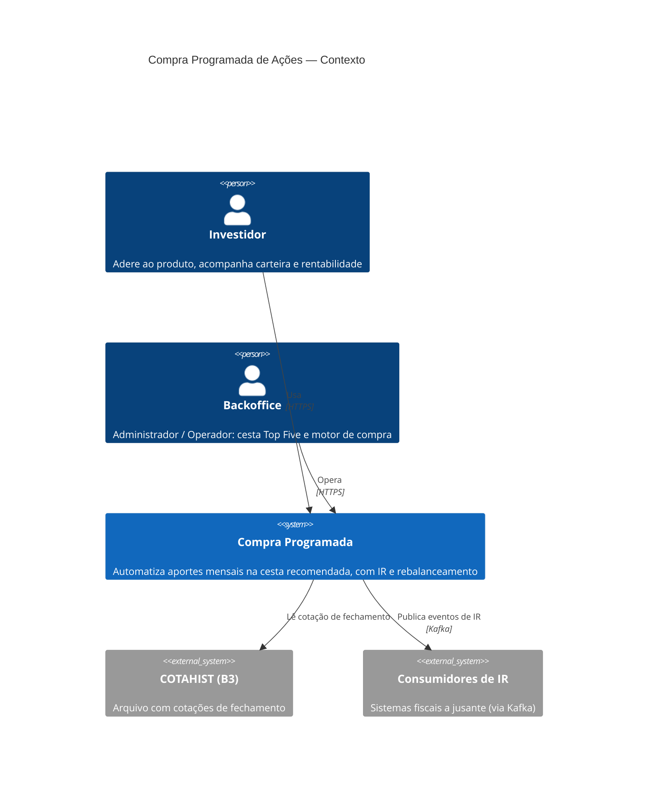
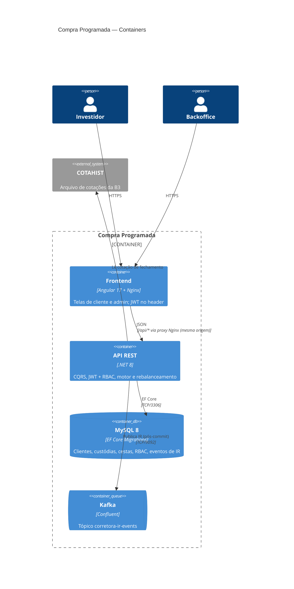
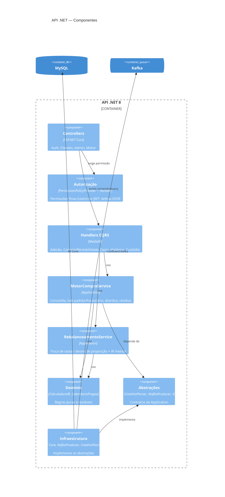

# Arquitetura — C4

Modelo C4 (Context → Container → Component) do Sistema de Compra Programada.
Diagramas em Mermaid (renderizam no GitHub). Decisões em [`docs/adr`](../adr).

## Nível 1 — Contexto



## Nível 2 — Containers



## Nível 3 — Componentes (dentro da API)



## Dependências entre camadas (inversão)

```
API → Application → Domain
Infrastructure → Application → Domain
```

`Application` **não** referencia `Infrastructure`: depende de abstrações que ela mesma define
(`src/Application/Abstractions`), implementadas pela Infraestrutura. Dependências apontam para
dentro (Clean Architecture). Detalhe em [ADR-0003](../adr/0003-inversao-de-dependencia.md).
